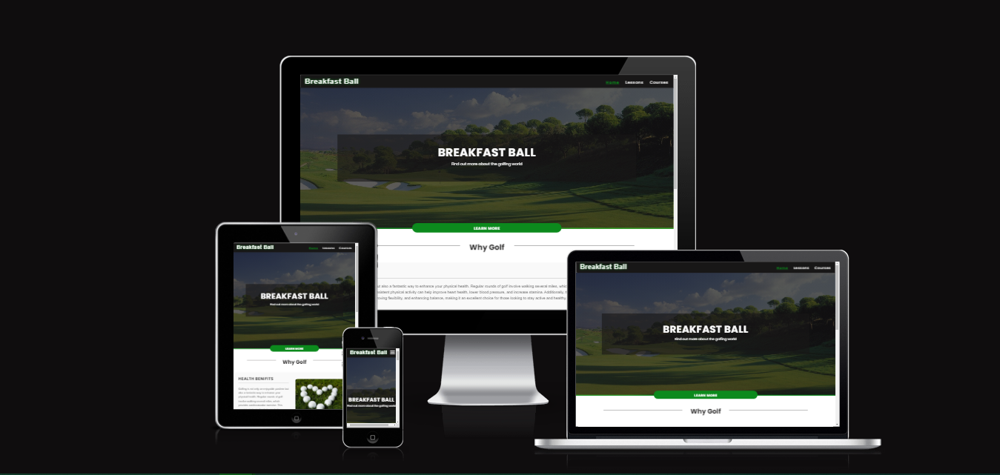

# Breakfast Ball #

## Description ##

Breakfast Ball welcomes golfers of all ages and skill levels. ⁤⁤Breakfast Ball offers a variety of golf classes, whether you're an expert player looking to improve and broaden your abilities or a total novice ready to start your golfing journey. ⁤⁤These classes are expertly designed to walk you through the foundations or help you reach new heights in your performance. ⁤⁤The platform is an invaluable tool for anybody trying to have a better knowledge and appreciation of golf because it is intended to be both entertaining and instructional. ⁤

The Breakfast Ball website is easy to navigate and offers a wealth of information and courses for users to explore. ⁤⁤There's a sign-up form for individuals who are interested, as well as sections on "Why Golf," cost, ability levels, and contact data on the website. ⁤⁤This website is designed for everyone with an interest in golf, regardless of whether you're currently an avid player or just interested in learning more. 

## Inspiration 

Inspired by the idea that golf should be accessible and pleasant to all people, regardless of ability level or age. Breakfast Ball was created with the understanding that golf can be a rewarding and scary sport. It provides organized instruction to those who are interested in learning more about the game. With its clear information, reasonable prices, and customized instruction, the website seeks to be a one-stop shop for golfers at any level of skill. Breakfast Ball aims to encourage a love of golf and assist people in improving their abilities and self-assurance on the course by providing an intuitive platform.

## User Experience
### **Project Goals**
- The website is designed with user-friendly navigation, allowing users to easily find information about golf lessons, pricing, skill levels, and more.
- Offer a visually appealing and responsive design suitable for both desktop and mobile users.
- Ensure a seamless and effective user interface.
### **Target Audience**
- Golf Beginners: Individuals who are new to golf and looking for a comprehensive guide to understanding the basics and getting started with their golfing journey.
- Intermediate Golfers: Players with some experience who want to improve their skills, refine techniques, or learn new strategies to raise their game to the next level.
- Golf Enthusiasts and Hobbyists: Anyone with a general interest in golf, from casual to avid players, seeking information, tips, or lessons to enhance their enjoyment, understanding and skill of the sport.

## Design
### **Colours**

- Dark Green (#0c8a1d): A deep green used for accents and highlighting key elements.
- Dark Gray/Black (#181717): A dark background color providing contrast for lighter text and elements.
- Light Gray/White (#fafafa): A soft, light color used for text against dark backgrounds.
- Off-White (#f9f9f9): A subtle, warm background color used for content areas to maintain readability and contrast.
   

### **Typography**
- All icons were sourced through [font Awesome](https://fontawesome.com/)
- All fonts were sourced through [Google Fonts](https://fonts.google.com/)
- Titillium Web
- Poppins
  
## Features

### **Navigation Bar**

- Featured at the top of each page, the navigation shows the club name "Breafast Ball" in the left corner that links to the home page.
- The navigation links to the right: Home, Lessons and Courses link to different pages.
- The navigation menu is designed to be fixed at the top of the screen and is hidden by default on smaller screens.

 

Navigation Images

  
| Desktop                                                                            | Mobile                                                                           |
| ---------------------------------------------------------------------------------- | -------------------------------------------------------------------------------- |
|             |  |

 

 
### **Home Page**

**Hero Section**
- The Hero section shows the name of the club, using an off white color.
- The hero section uses a background image with a dark overlay to make text content more legible and visually appealing.
- The size of the overylay uses the full length of the screen for mobile screens and this desreases for larger devices.

Hero Section Image

| Desktop                                                                            | Mobile                                                                           |
| ---------------------------------------------------------------------------------- | -------------------------------------------------------------------------------- |
|                              |  |

**Why Golf**
- Breakfast Ball aims to educate visitors about the many reasons to consider golf as a sport of choice, fostering a welcoming atmosphere for newcomers and promoting a healthy, active lifestyle.
- This description provides a clear understanding of the "Why Golf?" section's purpose and content, making it easy for potential contributors or users of the website to understand its significance.

Why Golf Section Image

| Desktop                                                                            | Mobile                                                                           |
| ---------------------------------------------------------------------------------- | -------------------------------------------------------------------------------- |
|                              |  |

### **Courses Page**
**Gallery**

- Each gallery section is accompanied by a detailed description of the course including its history allowing the user to learn more about the challenges and heritage of each course.
- The gallery is designed to be intuitive and easy to navigate, allowing users to explore different courses. The gallery has a horizontal scroll allowing the user to look at the the photos and not be overwhelmed with content.

Gallery Image

   

### **Lessons Page**
**Pricing**

- The pricing structure is designed to be transparent and flexible, accommodating different budgets and preferences.
- The section allows users to easily compare different lesson packages and pricing tiers, making it simple to select the most suitable coaching plan.

Pricing Section Image

**Sign-up Form**
- The signup form is designed with simplicity and ease of use in mind. It requires basic information such as name, email address, and password, allowing new users to register quickly.
- The Signup Form helps to engage new users and enhance their experience on the Breakfast Ball platform.

Sign-up Image

## Testing

 - Breakfast Ball has been tested consistently across different browsers: Chrome, Firefox, Safari, Edge.
 - Responsiveness has been tested on  various devices (desktop, tablet, mobile) and screen sizes to ensure the layout adapts properly.

### **Feature Testing**

**Navigation Bar**

- Test the navigation bar's responsiveness across different screen sizes.
- Verify that clicking on each navigation links correctly loads the associated page (Home, Lessons or Courses Pages).
- Check that the navigation bar remains fixed at the top of the page when scrolling.
- Ensure the mouse hover effect is visible when hovering over a navigation links.
- Check that the active page link will be underlined and highlighted.

**Sign-up Form**

- Ensure that the form cannot be submitted if any required fields are left empty.
- Verify that when all required fields are correctly filled in and all input data meets the validation criteria, the form is successfully submitted and the user is redirected.
- Confirm that all input fields have the correct HTML input types (e.g., email, number, password) to enhance validation.

**Bugs**

- When Breakfast Ball was deployed to Github pages, the links to image files were not working.
- This was due to the fact that absolute file paths were used, to correct this see below.

### **Google Lighthouse**

Google lighthouse scores can be found below.

**Home Page**

**Courses Page**

**Lessons Page**

### **Validator Testing**

**HTML**
- No errors were detected when running through the official W3C Validator
- This was run for all pages

**CSS**
- No errors were detected when run through the official (Jigsaw) Validator

## Deployment 

**Manual Deployment**

Breakfast has been deployed to Github pages as follows:

- Go to **Settings** tab in the Github Repository.
- From the **"Code and automation"** section, select **pages**.
- Set source to 'Deploy from Branch', make sure **Main branch** is selected.
- Under Branch, click **save**.
- The page will be automatically refreshed, in the **Enviroments** section you will be able to veiw the live site.
  

 The live site can be found: https://craig-grant630.github.io/Breakfast-Ball

 **Forking Repository**
- Go to the GitHub repository.
- Select **"Fork"** button on the page.
- This will create a copy of the repository in your GitHub account.

**Clone Repository**

- Go to the GitHub Repository.
- Click the Code button and copy the link.
- In Gitpod, type "git clone **repository link copied**.git" and enter.

  
